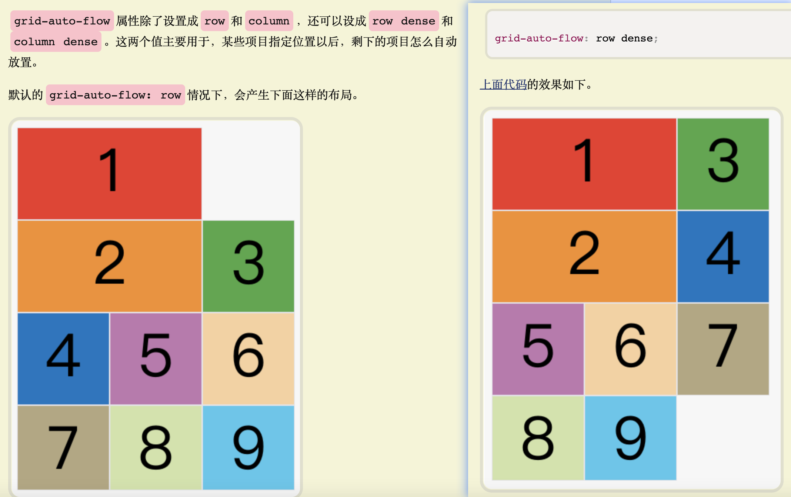

# grid

- [阮一峰 grid](https://www.ruanyifeng.com/blog/2019/03/grid-layout-tutorial.html)
- [MDN grid](https://developer.mozilla.org/zh-CN/docs/Web/CSS/grid)
- [bilibili grid]()

```css
/*
    容器属性
    根据最新标准，grid-column-gap、grid-row-gap、grid-gap的grid-前缀已经删除
*/
display: grid | inline-grid;
/* 同grid-template-columns */
grid-template-rows: 100px 50px 100px 50px 20%;
/* 每列的列宽，每行的行高。可使用像素或者百分比(相对于grid容器本身) */
grid-template-columns: 100px 50px 100px 50px 20%;
/* 容器大小不定，item大小固定，要想每行(列)尽可能容纳,auto-fill表示自动填充 */
grid-template-columns: repeat(auto-fill, 100px);
grid-template-columns: repeat(auto-fill, 100px) 20%;
/* repeat(2, 100px, 50px) 等同于 100px 50px 100px 50px */
grid-template-columns: repeat(2, 100px, 50px) 20%;
/* 为方便表示比例关系,网格布局提供关键字 fr(fraction缩写,意为片段)。先分配百分比，剩下按份额划分 */
grid-template-columns: 2fr, 1fr 2fr 1fr 20%;
/* minmax(minValue, maxValue) 产生一个长度范围表示长度在这个范围之间(包含)，若minValue > maxValue 取 minValue值 */
/* 如果容器未设置高度则1fr是100px, 如果容器高度大于等于300px,则三者均分，否则第三项占100px */
grid-template-columns: 1fr 1fr minmax(100px, 1fr)
/* auto关键字。由浏览器自己决定宽度。以下是会先根据容器宽度分配值和百分比，剩余部分auto */
grid-template-columns: 100px 20% auto;
/* 使用[] - 方括号指定网格线的名称，方便之后引用，同一根线允许多个名称。注意是网格线的名称，此处数量是 列数 + 1 */
grid-template-columns: [a A column-1] 100px [b] 50px [c] 100px [d] 50px [e] 20% [f];

/* 设置行与行之间的间距（行间距） */
row-gap: 20px;
/* 设置列与列之间的列间距（列间距） */
column-gap: 20px;
/* row-gap和column-gap的简写, 只写一个默认第二个值与第一个相同 */
gap: 20px 20px;

/* 定义区域。一个区域由一个或多个单元组成 */
/* 每个不同的字母表示一个区域。'.'表示没用用到单元格或单元格不属于任何区域。'g g g'表示多个单元格合并为一个区域 */
/* 区域的命名会影响网格线。每个区域的起始网格线会自动以 '<区域名>-start' 命名 终止网格线自动以 '<区域名>-end' 命名 */
grid-template-area: 'a b c'
                    'd . e'
                    'g g g';

/* 划分网格后，子元素默认会按照'先行后列'的顺序依次填充每个网格。*/
/* row dense 表示先列后行，之后尽可能填满, 具体表现见最下方截图 */
grid-auto-flow: row | column | row dense | column dense;

/* 设置单元格内容水平位置（左中右）和垂直位置（上中下）,place-items为二者简写，一个值表示两者相同 */
justify-items: start | end | center | stretch;
align-items: start | end | center | stretch;
place-items:<justify-items> <align-items>;

/* 在整个内容区域的水平位置和垂直位置 */
justify-content: start | end | center | stretch | space-around | space-between | space-evenly;
align-content: start | end | center | stretch | space-around | space-between | space-evenly;
place-content: <align-content> <justify-content>;

/* 有时一些项目的位置在现有网格的外部，比如网格只有三列但指定一个项目在第五列，这是浏览器会自动生成多余的网格以便安置项目 */
/* 写法与grid-template-columns完全一致,如果不指定，浏览器完全按单元格内容大写决定新增网格的列宽和行高 */
grid-auto-columns: 100px 50px 100px 50px 20%;
grid-auto-rows: 100px 50px 100px 50px 20%;

/* grid-template-columns、grid-template-rows、grid-template-area的简写 */
grid-template: ...;

/* grid-template-columns、grid-template-rows、grid-template-area */
/* grid-auto-columns、grid-auto-rows、grid-auto-flow这六个属性的简写 */
grid: ...;

/*
    项目属性
*/
/* 指定项目的四个边框，分别定位在哪根网格线。span: 表示跨越，如果发生重叠可用z-index */
/* grid-column、grid-row是两个简写。'/'及后面的内容可以省略，默认跨越一个网格 */
grid-column-start: 2;
grid-column-end: span 2;
grid-row-start: a-start;
grid-row-end: a-end;
grid-column: 2 / span 2;
grid-row: <start-line> / <end-line>;

/* 指定项目放在哪个区域。指定区域名或直接指定项目位置 */
grid-area: a;
grid-area: <row-start> / <row-end> / <column-start> / <column-end>;

/* 设置单元格内容水平位置和垂直位置。与justify-items和align-items用法完全一致 */
justify-self: start | end | center | stretch;
algin-self: start | end | center | stretch;
place-self: <align-content> <justify-content>;

```

- grid-auto-flow 的值 row 和 row dense 的表现
  
